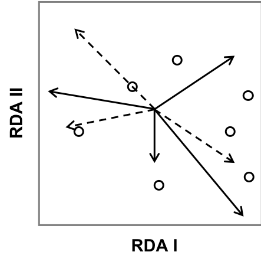

## Workshop outline

<br> 


1. Why mapping in R?

2. Spatial data & Coordinate reference system

3. Importation & attribute manipulation of vector data with `sf`

4. Importation of raster data with `raster`

5. Geometry manipulations for vector and raster data

6. Thematic & interactive maps

6. Questions, discussion, and use of your data


```{r packages, message=F, eval = T, echo=F}
library(sf) # for simple features vector
library(lwgeom) # for st_make_valid
library(dplyr) # for data manipulation
library(RColorBrewer) # for color palette
library(raster) # for raster data
library(mapview) # for interactive map
library(knitr)
library(reshape2)
```

```{r setup, echo=FALSE}
knitr::opts_chunk$set(fig.align = "center", fig.height = 5) 
```

# Why?


## Mapping in Ecology?

<div class="columns-2">
```{r, echo=F, out.width="90%", fig.align="center"}
knitr::include_graphics("https://insileco.github.io/post/rinspace_custommaps/index_files/figure-html/unnamed-chunk-1-1.png")
```

<br> 

1. show where your plots are

2. show how variables are distributed spatially

3. show results of spatial analyses
</div>
<br>

[R code for this map](https://insileco.github.io/2018/04/06/r-in-space---custom-mapping/)

## Why using R as a GIS?

1. **Open-source, free**
    - Benefit from a very active community
    - Very large number of packages


## Why using R as a GIS?

1. Open-source, free

1. **Workflow and replicability**
    - import, format, analyze, visualize, export your data
    - repeat with new data
    - create your own functions/packages

  


## Why using R as a GIS?

1. Open-source, free

1. Workflow and replicability

2. **Quite efficient**
    - well-defined spatial classes
    - can read/write/convert many formats


## Why using R as a GIS?

1. Open-source, free

1. Workflow and replicability

2. Quite efficient

3. **Many interfaces to other software**
    - C/C++: [Geos](http://trac.osgeo.org/geos), [proj4](http://proj4.org/), [Gdal](http://www.gdal.org/)
    - JavaScript: [Leaflet](https://rstudio.github.io/leaflet/)
    - otherGIS: [RQGIS](https://cran.r-project.org/web/packages/RQGIS/index.html), [rgrass7](https://cran.r-project.org/web/packages/rgrass7/index.html), [RgoogleMaps](https://cran.r-project.org/web/packages/RgoogleMaps/index.html)
    - retrieve data: [osmdata](https://github.com/ropensci/osmdata)

> See [Chapter 10 of Geocomputation with R](https://geocompr.robinlovelace.net/gis.html#gis)

## But...

Possible limitations

  - Geo-referencing  [<i class="fa fa-external-link" aria-hidden="true"></i>](http://robertmyles.github.io/2016/08/13/geo-reference-an-image-in-r/)
  - Visualizing large spatial objects
  - Watershed analysis
  - ...

# Spatial data

## Vector data

<br>

<br>

```{r vector, echo=F, out.width = "80%", fig.align="center"}
include_graphics("https://insileco.github.io/post/rinspace_spobjects/index_files/figure-html/vector-data-1.png")
```

## Raster data

<br>

<br>

```{r raster, echo=F, out.width = "80%", fig.align="center"}
include_graphics("https://insileco.github.io/post/rinspace_spobjects/index_files/figure-html/raster-data-1.png")
```

# Coordinate reference system


## Coordinate reference system (CRS)

- Any place on the earth can be specified by a latitude and longitude or X/Y coordinates


```{r projmap, echo=F, out.width="50%"}
include_graphics("http://gistbok.ucgis.org/sites/default/files/figure2-projections.png")
```

## Geographic vs projected CRS

**Geographic** (or unprojected) CRS 

- Uses latitude and longitude coordinates, which are angles measured from the earth's center to a point on the earth's surface
- 3-D representation of the earth (sphere or ellipsoid)
- Distance in geographic CRSs are therefore measured in degrees, not meters
- Lat/lon can locate exact positions on earth's surface, but are not uniform units of measure

**Projected** CRS

- Uses cartesian coordinates, Easting and Northing (x and y) typically in meters
- 2-D representation of the earth
- All projected CRSs are based on a geographic CRS
- Different mathematical formulas (i.e. projections) can transform the 3-D globle to a 2-D map

## Projected vs geographic CRS


```{r canada, echo=F, warning=F, fig.height=4.8, fig.width=9}
can <- raster::getData("GADM", country = "CAN", level = 1, path = "data/")
can <- st_as_sf(can)

qc <- can[can$NAME_1 == "Québec",]
qc_simple <- st_simplify(qc, dTolerance = .01, preserveTopology = F)
qc_simple_prj <- st_transform(qc_simple, 32188)

par(mfrow=c(1,2), mar = c(2,3,2,1))
plot(st_geometry(qc_simple), main = "Geographic CRS - Lat/Lon", graticule=T, axes=T, cex.axis=0.8, las=1)
plot(st_geometry(qc_simple_prj), main = "Projected CRS - UTM", graticule=st_crs(qc_simple_prj), axes=T, cex.axis=0.8, las=1)
```


> [What are geographic coordinate systems?](http://desktop.arcgis.com/en/arcmap/10.3/guide-books/map-projections/about-geographic-coordinate-systems.htm)
> <br>
> [What are projected coordinate systems?](http://desktop.arcgis.com/en/arcmap/10.3/guide-books/map-projections/about-projected-coordinate-systems.htm)

## Define CRS with EPSG or proj4string

Many, many ways to represent the 3-D shape of the earth and to project it in a 2-D plane

- each CRS can be define either by an `EPSG` or `proj4string`
  
> The EPSG code is a numeric representation of a CRS, while the proj4string reprensents the full set of parameters spelled out in a string:
> <br>
> EPSG `4326` <=> proj4 `+proj=longlat +ellps=WGS84 +datum=WGS84 +no_defs`
> <br>
> EPSG `32188` <=> proj4 `+proj=tmerc +lat_0=0 +lon_0=-73.5 +k=0.9999 +x_0=304800 +y_0=0 +ellps=GRS80 +datum=NAD83 +units=m +no_defs`

- All geographic files were created using a specific CRS - but it's not always defined!

- To find CRS in any format: [Spatial Reference](http://spatialreference.org/)


# Vector data with `sf`


## Intro to Simple Features


Why use the `sf` package when `sp` is already tried and tested?

- Simple features refers to a formal standard (ISO 19125-1:2004) that describes
how objects in the real world can be represented in computers

- Soon to be the successor of `sp`

- `sf` incorporates the functionality of the 3 main packages of the `sp` paradigm in a single, cohesive whole:
    - `sp` for the class system; 
    - `rgdal` for reading and writing data; 
    - `rgeos` for spatial operations undertaken by GEOS).
    
  

## Intro to Simple Features

Why use the `sf` package when `sp` is already tried and tested?

- `sf` objects are easy to manipulate
  - Spatial objects are stored as data frames, with the feature geometries stored in list-columns
  - All functions begin with `st_` for easy tab completion
  - Functions are pipe-friendly `%>%`
  - `dplyr` and `tidyr` verbs have been defined for the sf objects
  - Fast reading and writing of data
  - `ggplot` friendly

- GREAT documentation! [sf vignette](https://cran.rstudio.com/web/packages/sf/index.html)

## Intro to Simple Features

```{r, echo=F,  out.width = "50%"}
knitr::include_graphics("img/sf-classes.png")
```

## Intro to Simple Features

```{r, echo=F,  out.width = "100%"}
knitr::include_graphics("img/sf_object.png")
```

> [sf vignette #1](https://cran.r-project.org/web/packages/sf/vignettes/sf1.html)

## Import your dataset in R

- **Non-spatial data**
    - Water quality measures in Montreal ^1^

- **Vector data**
    - `MULTIPOINT` - sample points of water quality measures in Montreal ^1^
    - `MULTILINESTRING` - streams and rivers of Montreal ^1^
    - `MULTIPOLYGON` - polygons of land use types ^2^
    - `MULTIPOLYGON` - Canadian boundaries (retrieved directly from R)
    
- **Raster data**  
  - `raster` - canopy index of Montreal ^2^
  - `raster` - altitude (retrieved directly from R)

</style>
<div class="footer" style="margin-top;font-size:80%;"> 
1. [Portail de données ouvertes de Montréal](http://donnees.ville.montreal.qc.ca/dataset)
2. [Observatoire du Grand Montréal](http://cmm.qc.ca/donnees-et-territoire/observatoire-grand-montreal/produits-cartographiques/donnees-georeferencees/)
</div>

## Packages

```{r packages2, message=F, eval = F}
library(sf) # for simple features vector
library(lwgeom) # for st_make_valid
library(dplyr) # for data manipulation
library(reshape2) # for data manipulation
library(RColorBrewer) # for color palette
library(raster) # for raster data
library(mapview) # for interactive map
```


# From csv to `MULTIPOINT`


## Load and import sample points from a csv

This dataset defines the localisation of the sampling points for the RUISSO program. The latter consists in analyzing the bacteriological and physicochemical quality of inland streams and watercourses in Montreal.

```{r read_points1, message = F, warning =F}
# Create a new directory to download data
if(!dir.exists("data")) dir.create("data")

# Download csv file from web page in your working directory
if (!file.exists("data/ruisso.csv"))
  download.file("http://donnees.ville.montreal.qc.ca/dataset/86843d31-4251-4002-b10d-620aaa751092/resource/adad6c48-fb48-40fc-a031-1ac870d978b4/download/scri03.-infor03.02-informatique03.02.07-donneesouvertesrsmaruissostationsstations_ruisso.csv",
  destfile = "data/ruisso.csv")
```


> [Portail de données ouvertes de Montréal](http://donnees.ville.montreal.qc.ca/dataset)


## Load and import sample points from a csv

```{r read_points2, message = F, warning =F}
# Read csv file in R
ruisso <- read.csv("data/ruisso.csv", header = T, dec = ",")
names(ruisso)
```

## Convert to `sf` `MULTIPOINT` object


```{r convert_to_sf, eval=T}
ruisso_sf <- st_as_sf(
  x = ruisso,
  coords = c("LONGITUDE", "LATITUDE"),
  crs = 4326) # the CRS is given in the metadata
ruisso_sf
```

## Simple mapping of `MULTIPOINT`

Instead of creating a single map, as with `sp` object, the default plot of `sf` object creates multiple maps, one for each attribute, which can be useful for exploring the spatial distribution of different variables.

```{r plot_pts1, fig.height=4, fig.width=6}
plot(ruisso_sf)  
```


## Simple mapping of `MULTIPOINT`

To plot only the geometry and not all attributes, we retrieve the geometry
list-column using `st_geometry()`:

```{r plot_pts2}
plot(st_geometry(ruisso_sf))
```


## Load and import sample data from a csv

This dataset contains the actual water quality measurements at the RUISSO sampling points.

```{r read_data1}
# Download csv file from web page in your working directory
if (!file.exists("data/donnees_ruisso_2016.csv"))
  download.file("http://donnees.ville.montreal.qc.ca/dataset/8c149ace-7b2f-4041-99ec-3bdbef5dcee6/resource/38c8eb26-46a1-4fc2-87a0-5c88e94cee8e/download/donnees_ruisso_2016.csv",
  destfile = "data/ruisso_data.csv")
```

<br> 

> [Portail de données ouvertes de Montréal](http://donnees.ville.montreal.qc.ca/dataset)


## Load and import sample data from a csv

```{r read_data2}
# Read csv file in R
ruisso_data <- read.csv("data/ruisso_data.csv", header = T, dec = ",")
head(ruisso_data)
```


# Attribute manipulations & data cleaning

```{r, echo=F, out.height="250px"}
include_graphics("https://cdn-images-1.medium.com/max/1600/1*44nbQ40A1XYe97bixBgCOw.gif")
```


## Join these sampled data as attributes

Combining data from different sources is a common task in data preparation. `left_join()` from `dplyr` do this by combining tables based on a shared ‘key’ variable. 

> See [dplyr and tidyr cheatsheet](https://www.rstudio.com/wp-content/uploads/2015/02/data-wrangling-cheatsheet.pdf) for other join functions.

```{r add_attributes, warning=F}
ruisso_sf <- left_join(ruisso_sf, ruisso_data, by = "Point.d.échantillonnage")
names(ruisso_sf)
```


## Data cleaning

Keep only active sites

```{r cleaning1}
ruisso_sf1 <- filter(ruisso_sf, Activité == "Actif")
# same as
# ruisso_sf1 <- filter(ruisso_sf, Activité != "Inactif")
dim(ruisso_sf)

dim(ruisso_sf1)
```

## Data cleaning

Remove unwanted variables

```{r cleaning2}
ruisso_sf2 <- dplyr::select(ruisso_sf1, 
                            -Localisation, 
                            -Activité, 
                            -Raison.d.annulation, 
                            -Signe.COLI, 
                            -MÉTÉO)
```

> Note: Both `raster` and `dplyr` packages have a function called `select()`. To avoid an error message when both packages are loaded, we use the long-form function name: `dplyr::select()`.

## Data cleaning

```{r cleaning2.1}
names(ruisso_sf2)
```

## Data cleaning

Rename some variables

```{r cleaning3}
ruisso_sf3 <- rename(ruisso_sf2,
  river = Plan.d.eau,
  sample_pts = Point.d.échantillonnage,
  dissolve_O = X.OD)
names(ruisso_sf3)
```


## Data cleaning

Remove symbole from column names

```{r cleaning5}
names(ruisso_sf3) <- gsub("\\..*", "", names(ruisso_sf3))
names(ruisso_sf3)
```

> [Tuto on regular expression](https://rstudio-pubs-static.s3.amazonaws.com/74603_76cd14d5983f47408fdf0b323550b846.html)


## Data cleaning

Remove accent from column names

```{r cleaning6}
names(ruisso_sf3) <- gsub("é", "e", names(ruisso_sf3))
names(ruisso_sf3)
```

> [Tuto on regular expression](https://rstudio-pubs-static.s3.amazonaws.com/74603_76cd14d5983f47408fdf0b323550b846.html)

## Summarise attributes by sample plots

There are multiple measurements during the summer.

```{r summ_attribute1}
ruisso_sf3
```

## Summarise attributes by sample plots

We will use the mean of water quality measurements.

```{r summ_attribute2, warning=F, fig.width=6, fig.height=5}
ruisso_mean <- ruisso_sf3 %>%
  group_by(sample_pts) %>% # split the data into groups of samples
  summarise_at(vars(O2:Zn), mean, na.rm = TRUE) # compute the mean by group on selected variables
ruisso_mean
```


## Simple mapping of attributes

```{r plot_attribute1, warning=F, fig.height=5}
plot(ruisso_mean)  
```

## Simple mapping of attributes


```{r plot_attribute2, eval=F}
myPal <- colorRampPalette(c("blue", "red"))
plot(ruisso_mean["Temperature"],
  pal = myPal, nbreaks = 30, pch = 19, key.pos = 1,
  main = "Water temperature in streams of Montreal")
```

```{r plot_attribute2.1, echo=F, fig.width=4.5, fig.height=4}
par(mar=c(0,0,0,0))
myPal <- colorRampPalette(c("blue", "red"))
plot(ruisso_mean["Temperature"],
  pal = myPal, nbreaks = 30, pch = 19, key.pos = 1,
  main = "Water temperature in streams of Montreal")
```


## Export your `MULTIPOINT` to a Shapefile

We can write a simple features object to a file (*e.g.* a shapefile) using the
`st_write()` function in `sf` (see [vignette](https://cran.r-project.org/web/packages/sf/vignettes/sf2.html))

```{r export, warnings = FALSE, results="hide"}
st_write(ruisso_mean, dsn = "data/ruisso.shp", driver = "ESRI Shapefile", delete_dsn = T)
```

> Some argument specifications varies by driver, see `?st_write`

# Import `MULTIPOLYGON`

## Load and import land use polygons

We will now import a land use vector map of Montreal.

```{r lu_pdf, echo = F, out.width="60%"}
include_graphics("img/LU_montreal.jpeg")
```

> [Observatoire du Grand Montréal](http://cmm.qc.ca/donnees-et-territoire/observatoire-grand-montreal/produits-cartographiques/donnees-georeferencees/)


## Load and import land use polygons

Because the original dataset was composed of multiple individual shapefiles and were long to download, these manipulations should have been performed before the workshop using this [R script](https://github.com/mhBrice/Rspatial/blob/master/script/Rspatial_data.R). 

*Don't run these lines now!*
```{r lu_download, eval = F}
# Download shapefiles
download.file("http://cmm.qc.ca/fileadmin/user_upload/geomatique/UtilisationDuSol/2016_Shapefiles/660-US-2016.zip", destfile = "data/landuse.zip")

# Unzip the main folder and name it "landuse"
unzip("landuse.zip", exdir="data/landuse")

# get all the zip files inside the main folder "landuse"
zipF <- list.files(path = "data/landuse/", pattern = "*.zip", full.names = TRUE)

# unzip all your files
plyr::ldply(.data = zipF, .fun = unzip, exdir = "data/landuse")
```

## Load and import land use polygons

*Don't run these lines now!*
```{r lu_download2, eval = F}
# Get the names of the land use shapefiles from the folder "landuse"
shp_files <- list.files(path = "data/landuse", pattern = ".shp")
shp_files <- sub(".shp", "", shp_files)

# Read all the shapefiles
LU <- list()
for(f in shp_files) {
  LU[[f]] <- st_read(dsn = "data/landuse/", layer = f)
}

# Combine all shapefiles together
LU_all <- do.call(rbind, LU)

# Write as a GeoPackage
st_write(LU_all, "data/LU_all.gpkg", driver = "GPKG")
```

## Load and import land use polygons

```{r read_poly}
# Read GeoPackage in R
LU <- st_read(dsn = "data/LU_all.gpkg")
```

> Notice that the EPSG code is not defined


## Defining the crs with st_set_crs()

To define the CRS when it's missing we can use `st_set_crs()`. 

Note however that replacing crs does not reproject data. If we wanted to transform coordinate and reproject them, we would use `st_transform()`. 

```{r set_crs_poly}
LU <- st_set_crs(LU, 32188)
```

<br>

> [sf vignette #3](https://cran.r-project.org/web/packages/sf/vignettes/sf3.html#coordinate-reference-systems-conversion-and-transformation)


## Simple mapping `MULTIPOLYGON`

We can map only one land use at a time by subsetting first the `sf` object. `UTIL_SOL==1000` represents water. I don't recommend you try to plot everything... it would take forever!

```{r plot_poly, eval=F}
plot(st_geometry(subset(LU, UTIL_SOL==1000)))
```

```{r plot_poly2, echo=F}
par(mar=c(0,0,0,0))
plot(st_geometry(subset(LU, UTIL_SOL==1000)))
```

## Corrupt or invalid geometries?

Geometry validity refers to essential properties of polygons, such as non-self
intersecting, holes being inside polygons, more than 4 points, closing
segments. Invalid geometry can be ignored for mapping but cause problem for
spatial operations.

`st_is_valid()` returns a logical vector indicating for each polygon geometries
whether it is topologically valid:

```{r valid_poly}
(invalid_poly <- which(!st_is_valid(LU)))
```

## Corrupt or invalid geometries?

Geometry validity refers to essential properties of polygons, such as non-self
intersecting, holes being inside polygons, more than 4 points, closing
segments. Invalid geometry can be ignored for mapping but cause problem for
spatial operations.

Using the argument `reason = TRUE` returns the reason for invalidity:

```{r valid_poly2}
st_is_valid(LU[invalid_poly,], reason = TRUE)[1:8]
```


## Corrupt or invalid geometries?

```{r plot_invalid}
par(mfrow = c(1,2))
plot(st_geometry(LU[862,]), main = "Nested shells")

plot(st_geometry(LU[1251,]), main = "Self-intersection")
```


## Corrupt or invalid geometries?

We can use `st_make_valid()` from `lwgeom` to make an invalid geometry valid

```{r make_valid}
LU_val <- st_make_valid(LU)

# let's verify if all geometries are now valid
which(!st_is_valid(LU_val)) # yeah!
```

# Exercise

```{r, echo=F, out.height="200px"}
include_graphics("https://media.giphy.com/media/zmNw0b29WEFO/giphy.gif")
```

## Exercise

<ol>
<li>Import a shapefile of watercourses in Montreal (courseau.shp) using `st_read(dsn = path_to_file, layer = file_name, driver = "ESRI Shapefile")` and name it `courseau`
</ol>

> If you did not load the shapefile before the workshop you can download it using `download.file()` from this link : http://donnees.ville.montreal.qc.ca/dataset/c128aff5-325c-4599-ab66-1c9d0b3abc94/resource/a37e11d4-f0a3-46a7-8636-76754fad72b3/download/courseau.zip 

<ol start="2">
<li>Create a simple map of the geometry

<li>Create a simple thematic map of watercourse `TYPE`. You can change the default colors using the argument `pal`.
</ol>


```{r read_courseau, echo=F, warning=F, message=F}
# Download shapefile from web page in your working directory
if (!file.exists("data/courseau.zip"))
  download.file("http://donnees.ville.montreal.qc.ca/dataset/c128aff5-325c-4599-ab66-1c9d0b3abc94/resource/a37e11d4-f0a3-46a7-8636-76754fad72b3/download/courseau.zip", destfile = "data/courseau.zip")

# Unzip the main folder
unzip("data/courseau.zip", exdir = "data/courseau")

# For GeoJSON, dsn may be the character string holding the geojson data
courseau <- st_read(dsn = "data/courseau/", layer = "courseau", quiet = T)
```


## Exercise

```{r see_line}
courseau
```


## Exercise

```{r plot_line, echo=F}
par(mar=c(0,0,0,0))
plot(st_geometry(courseau))
```

## Exercise

```{r plot_line2, echo=F}
par(mar=c(0,0,0,0))
plot(courseau["TYPE"], key.pos = 1, pal = brewer.pal(4, "Paired"))
```


# Raster data with `raster`


## `raster` classes


The R package raster provides three main classes of raster object:

<p>

`RasterLayer` - a single-layer (variable) raster (e.g. elevation)

`RasterStack` - one single object several single-layer (variable) rasters stored in one or different files (e.g. Worldclim bioclimatic variables)

`RasterBrick` one single object several single-layer (variable) rasters stored in one single file (e.g. a single multispectral satellite file)
</p>

> [Raster data](http://www.rspatial.org/spatial/rst/4-rasterdata.html)

## Import raster data

We now import raster data use a [.tif file](https://en.wikipedia.org/wiki/TIFF)
of a canopy index from Montreal.

```{r read_tif, warning=F}
# Download tif file from web page in your working directory
if (!file.exists("data/canopee.zip")){
  download.file("http://cmm.qc.ca/fileadmin/user_upload/geomatique/IndiceCanopee/2015/660_ Canopee2015_3m.zip", destfile = "data/canopee.zip") }

unzip("data/canopee.zip", exdir = "data")

# Read tif in R using raster
# The file named "660_CLASS_3m.tif" contains the canopy index for all the Montreal area, so we can read this file only
canopee_mtl <- raster("data/660_CLASS_3m.tif")
```

> [Observatoire du Grand Montréal](http://cmm.qc.ca/donnees-et-territoire/observatoire-grand-montreal/produits-cartographiques/donnees-georeferencees/)

## `raster`

```{r info_tif, warning=F}
canopee_mtl
```

The canopy index dataset is a `RasterLayer` with values from 1 to 5, `r nrow(canopee_mtl)` pixels
by row and `r ncol(canopee_mtl)` pixels by column and resolution of 1m x 1m.

## Simple mapping of `raster`

Similar to the `sf` package, `raster` also provides plot methods for its own classes.

```{r plot_tif1, eval=F}
plot(canopee_mtl)
```

```{r plot_tif, fig.height=4.5, echo =F}
par(mar=c(0,0,0,0))
plot(canopee_mtl)
```

## Retrieving free GIS data: `getData`

In package `raster`, `getData()` function generates requests to access to
different spatial datasets (either `raster`or `sp`). Argument `name` specifies the dataset you wish to download.

> `GADM` - global administrative boundaries at different level of administrative subdivision
> <br>
> `worldclim` - global interpolated climate data
> <br>
> `alt` and `STRM` - coarse and fine resolution elevation data
> <br>
> `ISO3` - 3 letter ISO codes for country names.

```{r getDat1}
head(getData("ISO3"))
```

## Retrieving free GIS data: `getData`

Retrieve a raster of altitude for Canada.

```{r getDat2}
# alt90 <- getData('SRTM', lon = -73.7, lat = 45.5) # Fine resolution
altCAN <- getData(name = "alt", country = "CAN", path = "data/") # Coarse resolution
altCAN
```

> Because the resolution of the altitude raster (0.0083x0.0083° = 650x926m) is a lot coarser than that
of the canopy index (1x1m), we will use the altitude raster for examples of raster manipulations to
reduce computation time.

## Retrieving free GIS data: `getData`

Retrieve a raster of altitude for Canada.

```{r plot_altcan1, eval = F}
plot(altCAN)
```

```{r plot_altcan,  fig.height=4.5, echo = F}
par(mar=c(0,0,0,0))
plot(altCAN)
```

# Exercise

```{r, echo=F, out.height="200px"}
include_graphics("https://media.giphy.com/media/zmNw0b29WEFO/giphy.gif")
```

## Exercise

1. use `getData()` to retrieve Canadian boundary map at the provincial level
    - `?getData`

2. Transform it to a `sf` object using `st_as_sf()`

3. Subset the Quebec boundary in the column `NAME_1`

4. Reproject your new object using the same projection that of the land use polygons (`st_crs(LU_val)` or with the EPSG code `32188`)

5. Try to plot the geometry of the Quebec polygon. 

6. Try `qc_simple_prj <- st_simplify(qc_prj, dTolerance = 500, preserveTopology = F)` and plot the geometry of this new object. Is there a difference?

## Exercise 

```{r plot_qc_simple}
plot(st_geometry(qc_simple_prj))
```


# Geometry manipulations on `sf`


## Buffer

```{r buffer1}
ruisso_buf <- st_buffer(st_geometry(ruisso_mean), dist = 0.01)
```

> `dist is assumed to be in decimal degrees` This message indicates that sf assumes a distance value is given in degrees

> `st_buffer does not correctly buffer longitude/latitude data` This warning indicates that the result may be incorrect because `st_buffer` expects coordinates in a 2-D, Euclidian space, which is not the case for longitude latitude data. So we should reproject the data onto a projected CRS.

## Buffer

```{r plot_buffer1, fig.align="center"}
plot(st_geometry(ruisso_mean), pch = 19, cex= .8)
plot(ruisso_buf, add = T, border= "blue3")
```

## Change projection: `st_transform`

We can reproject the sample points using a suitable projection that has units of
meters. To do this, we will use the projection from our land use polygons.

```{r proj}
(ruisso_proj <- st_transform(ruisso_mean, crs = st_crs(LU_val)))
```

## Buffer

```{r buffer2, fig.height=4, eval=F}
ruisso_buf <- st_buffer(st_geometry(ruisso_proj), dist = 500)
# add an attribute for sample points id
ruisso_buf <- st_sf(sample_pts = ruisso_mean$sample_pts, ruisso_buf)

plot(st_geometry(ruisso_proj), pch = 19, cex= .5)
plot(st_geometry(ruisso_buf), add = T, border= "blue3")
```

```{r buffer3, fig.height=3.8,echo=F}
ruisso_buf <- st_buffer(st_geometry(ruisso_proj), dist = 500)
ruisso_buf <- st_sf(sample_pts = ruisso_mean$sample_pts, ruisso_buf)
par(mar=c(0,0,0,0))
plot(st_geometry(ruisso_proj), pch = 19, cex= .5)
plot(st_geometry(ruisso_buf), add = T, border= "blue3")
```

# Exercise

```{r, echo=F, out.height="200px"}
include_graphics("https://media.giphy.com/media/zmNw0b29WEFO/giphy.gif")
```

## Exercise

1. Reproject the `courseau` object using the land use projection and name it `courseau_proj`

2. Create a 300m buffer around each watercourse and name it `courseau_buf`. Plot the resulting geometry with `courseau_proj` on top.

3. Try `st_union()` on `courseau_buf`. Plot the resulting geometry and compare with `courseau_buf`.

4. Try `st_centroid()` on `ruisso_buf`. Plot the resulting geometry with `ruisso_buf` under.

> For more geometric transformation such `st_difference()`, `st_convex_hull()`, `st_intersection()` see [sf vignette #3](https://cran.r-project.org/web/packages/sf/vignettes/sf3.html)

```{r exo_buf, echo = F}
courseau_proj <- st_transform(courseau, crs = st_crs(LU_val))
courseau_buf <- st_buffer(st_geometry(courseau_proj), dist = 300)
courseau_buf <- st_sf(ID = courseau_proj$OBJECTID_1, courseau_buf)
```

## Exercise

```{r exo_buf2, echo = F, fig.height =5}
par(mar=c(0,0,3,0))
plot(st_geometry(courseau_buf), col=NA, border="black", main = "st_buffer")
plot(courseau_proj["TYPE"], lwd = 1.2, add = T)
```

## Exercise

```{r exo_buf3, echo = F, fig.height =5}
buf_union <- st_union(courseau_buf)

par(mfrow=c(1,2), mar=c(0,0,3,0))
plot(st_geometry(courseau_buf), col=NA, border="black", main = "st_buffer")
plot(st_geometry(buf_union), col=NA, border="black", main = "st_union")
```

## Exercise

```{r exo_buf4, echo = F, fig.height =5}
ruisso_centroid <- st_centroid(ruisso_buf)

par(mar=c(0,0,3,0))
plot(st_geometry(ruisso_buf), col=NA, border="black", main = "st_centroid")
plot(st_geometry(ruisso_centroid), pch = 19, col="red", add = T)
```


## Simplify and reclassify land use types


```{r reclassify}
LU_reclas <- LU_val %>%
  dplyr::select(ID, UTIL_SOL) %>%
  mutate(UTIL_SOL = case_when(UTIL_SOL %in% c(100:114) ~ "resid",
                               UTIL_SOL %in% c(200:520) ~ "public_build",
                               UTIL_SOL == 600 ~ "green",
                               UTIL_SOL %in% c(700:760) ~ "road",
                               UTIL_SOL == 800 ~ "agri",
                               UTIL_SOL == 900 ~ "vacant",
                               UTIL_SOL == 1000 ~ "water",
                               UTIL_SOL == 1100 ~ "golf"))
```

> `case_when` allows you to vectorise multiple if and else if statements 


## Intersecting polygons for area calculations

We now want to find the proportion of area per buffer occupied by different land use types. `st_intersection()` can be used to obtain the intersection of two geometries (i.e. the area covered by both).

```{r intersect}
LU_inters <- st_intersection(LU_reclas, ruisso_buf)
``` 

> `Warning: attribute variables are assumed to be spatially constant`
> Attribute values are assigned to sub-geometries; if these are spatially 
constant, as for instance for land use, then this is fine. If they are 
aggregates, such as population count, then this is wrong.

## Intersecting polygons for area calculations

```{r plot_intersect, eval=F}
plot(LU_inters["UTIL_SOL"])
``` 

```{r plot_intersect2, echo=F}
par(mar=c(0,0,3,5))
plot(LU_inters["UTIL_SOL"])
``` 


## Intersecting polygons for area calculations

```{r intersect2}
# add in a column and compute area (area of each land use poly in intersect layer)
LU_inters$areaLU <- st_area(LU_inters)

# group data by sample points and land use type and calculate the total area for each land use per buffer
LU_area <- LU_inters %>%
  group_by(sample_pts, UTIL_SOL) %>%
  summarise(areaLU = sum(areaLU))

# remove geometry
st_geometry(LU_area) <- NULL
head(LU_area)
```

## Intersecting polygons for area calculations

```{r intersect3}
# buffer with 500m radius so area is pi*500^2 
# try st_area(ruisso_buf)

# compute proportion for each land use
LU_area$propLU <- as.numeric(LU_area$areaLU/(pi*500^2))

# transform to wide format and create a new data frame containing our new landscape variables
env_var <- dcast(data = LU_area, formula = sample_pts ~ UTIL_SOL, fill = 0)
```


# Geometry manipulations on `raster`


## Crop a raster for faster computation

`crop()` will decrease the extent of a raster using the extent of Montreal area. 


```{r crop, message = F, fig.align="center", fig.width=4, fig.height=4}
extMtl <- extent(c(xmin=-73.97342, xmax=-73.47562, ymin=45.39904, ymax=45.73252))
alt_crop <- crop(altCAN, extMtl) # Crop the raster
```

## Crop a raster for faster computation

`crop()` will decrease the extent of the raster using the extent of Montreal area.

```{r plot_crop, message = F, eval=F}
par(mfrow=c(1,2))
plot(altCAN)
plot(alt_crop)
```

```{r plot_crop2, echo=F, message = F, fig.align="center", fig.height=4}
par(mar=c(3,3,1,1), mfrow=c(1,2))
plot(altCAN)
plot(alt_crop)
```

## Reproject a raster

The projection of `alt_crop` is in longitude/latitude.

```{r proj_raster, message = F}
alt_crop
```

## Reproject a raster

We can use `projectRaster()` to transform the CRS of one spatial object to match another spatial object

```{r proj_raster2, message = F}
st_crs(LU_val)[[2]] # to retrieve the proj4string
alt_proj <- projectRaster(alt_crop, crs = st_crs(LU_val)[[2]])
alt_proj
```


## Extract and summarise raster values in buffer

Compute the mean altitude per buffer

```{r extract, message = F}
sample_alt <- raster::extract(alt_proj, as(ruisso_buf, "Spatial"), fun=mean, na.rm=TRUE)
head(sample_alt)
# Add this new environmental variables to our data frame
env_var <- cbind.data.frame(env_var, altitude = sample_alt)
```

> See the package [`velox`](https://hunzikp.github.io/velox/extract.html) for faster raster extraction

## Statistical analyses

<br>

> Now that we have a clean data frame with water quality variables (mean measurements of water quality in different watercourses) and a data frame of landscape variables of interest (% of different land use types in a 500m buffer and mean altitude in a 500m buffer), we could performe various statistical analyses. 
> <br>



> For instance, we could run a Redundancy Analysis ([RDA](http://qcbs.ca/wiki/r_workshop10#canonical_analyses)) to study the influence of the landscape on water quality. If we had data on macroinvertebrate abundance, we could study the relative importance of the landscape and water quality on their distribution using [variation partitioning on RDA](http://qcbs.ca/wiki/r_workshop10#variation_partitioning_by_partial_rda).


# Custom map

## Custom map

`plot()` allows combination of multiple layers of information in a same graph, with the argument `add = T`

```{r custom, eval=F}
plot(canopee_mtl)
plot(st_geometry(courseau_proj), col = "#034ebf", lwd = 1.5, add = T)
plot(st_geometry(ruisso_proj), pch = 19, col = "#B00C0C", add = T)
```

```{r custom1,echo=F, fig.height=4, fig.width=5}
par(mar=c(3,3,0,0))
plot(canopee_mtl)
plot(st_geometry(courseau_proj), col = "#034ebf", lwd = 1.5, add = T)
plot(st_geometry(ruisso_proj), pch = 19, col = "#B00C0C", add = T)
```

## Custom map

Change the color palette for the raster levels. There are 5 levels and only 2 are pertinent: 3 = low vegetation cover and 4 = canopy (see [here](http://cmm.qc.ca/fileadmin/user_upload/geomatique/IndiceCanopee/2015/CMM_indiceCanopee_2015_methodologie.pdf) for info on the classification).

```{r custom2, eval=F}
myPal <- c("white", "white", "#BAE4B3", "#006D2C", "white") # color palette

plot(canopee_mtl, col = myPal, legend = F) # canopy raster
plot(st_geometry(subset(LU_val, UTIL_SOL==1000)), # UTIL_SOL==1000 -> rivers
     col = "#7eb0fc", border = "#7eb0fc",add=T) 
plot(st_geometry(courseau_proj), col = "#034ebf", lwd = 1.5, add = T) # watercourse
plot(st_geometry(ruisso_proj), pch = 19, col = "#B00C0C", add = T) # sample points
legend("bottomright", legend = c("Low vegetation", "Canopy"),  # legend
       fill = c("#BAE4B3", "#006D2C"), border="white", bty = "n")

```

## Custom map

<br>

```{r custom2.1, echo=F}
par(mar=c(3,3,0,0))
myPal <- c("white", "white", "#BAE4B3", "#006D2C", "white")

plot(canopee_mtl, col = myPal, legend = F)
plot(st_geometry(subset(LU_val, UTIL_SOL==1000)), 
     col = "#7eb0fc", border = "#7eb0fc", add = T) 
plot(st_geometry(courseau_proj), col = "#034ebf", lwd = 1.5, add = T)
plot(st_geometry(ruisso_proj), pch = 19, col = "#B00C0C", add = T)
legend("bottomright", legend = c("Low vegetation", "Canopy"), 
       fill = c("#BAE4B3", "#006D2C"), border="white", bty = "n")
```

## Custom map

Add an inset

```{r custom3, eval=F}
par(mar=c(3,3,2,0))

plot(canopee_mtl, col = myPal, legend = F) # canopy raster
plot(st_geometry(subset(LU_val, UTIL_SOL == 1000)), # UTIL_SOL==1000 -> rivers
     col = "#7eb0fc", border = "#7eb0fc", add = T) 
plot(st_geometry(courseau_proj), col = "#034ebf", lwd = 1.5, add = T) # watercourse
plot(st_geometry(ruisso_proj), pch = 19, col = "#B00C0C", add = T) # sample points
legend("bottomright", legend = c("Low vegetation", "Canopy"),  # legend
       fill = c("#BAE4B3", "#006D2C"), border="white", bty = "n")

par(fig = c(0.08, 0.6, 0.42, 1), new = T) # add inset at specified coordinates of the figure region

plot(st_geometry(qc_simple_prj), col = "grey85", bgc = "transparent") # Quebec polygon
points(286543, 5038936, pch = 17, col = "#B00C0C") # point on Montreal
```

## Custom map

```{r custom3.1, echo=F}
par(mar=c(3,3,2,0))

plot(canopee_mtl, col = myPal, legend = F)
plot(st_geometry(subset(LU_val, UTIL_SOL==1000)), 
     col = "#7eb0fc", border = "#7eb0fc", add=T) 
plot(st_geometry(courseau_proj), col = "#034ebf", lwd = 1.5, add = T)
plot(st_geometry(ruisso_proj), pch = 19, col = "#B00C0C", add = T)
legend("bottomright", legend = c("Low vegetation", "Canopy"), 
       fill = c("#BAE4B3", "#006D2C"), border="white", bty = "n")

par(fig = c(0.05, 0.5, 0.5, 1), mar = c(0,0,0,0), new = T) 

plot(st_geometry(qc_simple_prj), col = "grey85", bgc = "transparent", xpd =T)
points(286543, 5038936, pch = 17, col = "#B00C0C")
```

# Interactive map with `mapview`

## Interactive map

Join our environmental variables data frame as attributes to the `sf` sample points

```{r mapview_prep}
ruisso_env <- left_join(ruisso_proj, env_var, by = "sample_pts")
```


## Interactive map

```{r mapview1}
mapview(ruisso_env, zcol = 'COLI', legend=TRUE, layer.name = "E. coli density")
```

## Interactive map

```{r mapview2}
mapview(ruisso_env, cex = "public_build", map.types = "Esri.WorldImagery")
```

## Interactive map

```{r mapview3, fig.align="center"}
myPal <- colorRampPalette(brewer.pal(9, "YlGnBu"))
mapview(ruisso_env, zcol = "resid", cex = "COLI", legend = TRUE, col.regions = myPal, 
        layer.name = "% of residential area")
```

## Interactive maps

<iframe src="img/globe.html">
</iframe>

> [R script for this `plotly` map](https://github.com/mhBrice/Rspatial/blob/master/world_globe.R)

## Animated maps

```{r anim, echo=F, out.width="75%", fig.align="center"}
include_graphics("https://user-images.githubusercontent.com/1825120/38543030-5794b6f0-3c9b-11e8-9da9-10ec1f3ea726.gif")
```

> [Geocomputation with R](https://geocompr.robinlovelace.net/adv-map.html#animated-maps)

# Great online resources


## Great online resources

<div class="row">
  <div class="column" style="font-size:19px">
Good tutorials for spatial data in R

- [Raster analysis in R](https://mgimond.github.io/megug2017/)
- [Geocomputation with R](https://geocompr.robinlovelace.net/intro.html)
- [Spatial data in R](https://github.com/Pakillo/R-GIS-tutorial/blob/master/R-GIS_tutorial.md)
- [Document par Nicolas Casajus (fr)](https://qcbs.ca/wiki/_media/gisonr.pdf)
- http://r-spatial.org/
- [Tutorial on datacamp](https://www.datacamp.com/courses/spatial-analysis-in-r-with-sf-and-raster)
- [R in space - Insileco](https://insileco.github.io/2018/04/14/r-in-space---a-series/)

`sf` manipulations

- [sf vignette #4](https://cran.r-project.org/web/packages/sf/vignettes/sf4.html)
- [Geocomputation with R](https://geocompr.robinlovelace.net/attr.html)
- [Attribute manipulations](https://insileco.github.io/2018/04/09/r-in-space---attribute-manipulations/)
- [Tidy spatial data in R](http://strimas.com/r/tidy-sf/)
  </div>
  
  <div class="column" style="font-size:19px">

Maps in R

- [Introduction to visualising spatial data in R](https://cran.r-project.org/doc/contrib/intro-spatial-rl.pdf)
- [Geocomputation with R](https://geocompr.robinlovelace.net/adv-map.html)
- [choropleth](https://cengel.github.io/rspatial/4_Mapping.nb.html)
- [leaflet](https://rstudio.github.io/leaflet/)
- [Mapview](https://r-spatial.github.io/mapview/index.html)
- [tmap](https://cran.r-project.org/web/packages/tmap/vignettes/tmap-nutshell.html)
- [plotly](https://plot.ly/python/maps/)
- [Animated maps](https://insileco.github.io/2017/07/05/animations-in-r-time-series-of-erythemal-irradiance-in-the-st.-lawrence/)

Get free data

- [free data at country level](http://www.diva-gis.org/gdata)
- [Quebec free data](http://mffp.gouv.qc.ca/le-ministere/acces-aux-donnees-gratuites/)
- [sdmpredictors](https://cran.r-project.org/web/packages/sdmpredictors/index.html) access to many datasets in R
- [find more spatial data](https://freegisdata.rtwilson.com/)
- [create shapefile on line](http://geojson.io/)
- EPSG: [link1](http://spatialreference.org/); [link2](http://epsg.io/)
  </div>
</div>

